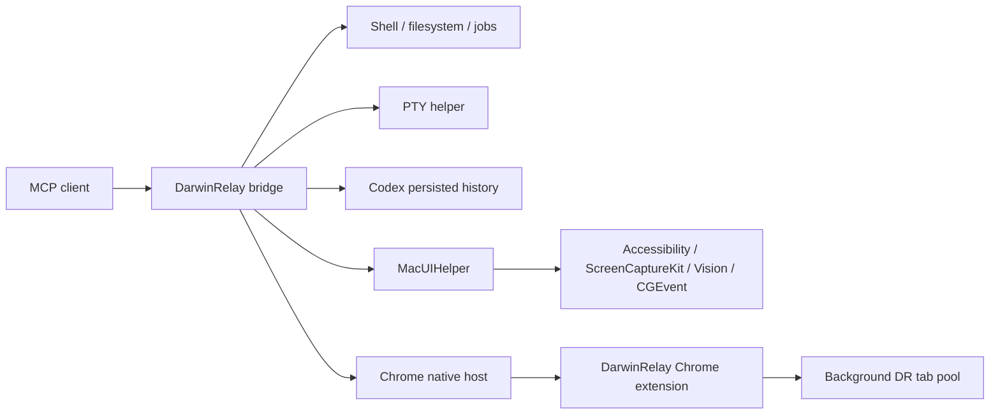

# DarwinRelay

[](https://github.com/dcierra/darwinrelay/actions/workflows/ci.yml)
[](https://github.com/dcierra/darwinrelay/actions/workflows/codeql.yml)
[](https://github.com/dcierra/darwinrelay/actions/workflows/codeql-swift.yml)
[](LICENSE)

**Turn ChatGPT into a local agent for your Mac.**

DarwinRelay is a source-first macOS MCP runtime that gives ChatGPT and other MCP clients structured access to the Mac you already use: shell and files, real PTYs, long-running jobs, background Chrome, native desktop control, and persisted Codex history.

Use ChatGPT itself like a local coding agent: let it inspect a repository, reproduce a failure, change the code, run the tests, and verify the result on your machine — without inserting another coding model between the conversation and macOS.

> [!CAUTION]
> DarwinRelay is intentionally powerful. It is **not a sandbox** and does not implement a filesystem or shell-command allowlist. A connected client can act with the effective permissions of the macOS user running the bridge. Read [SECURITY.md](SECURITY.md) before connecting a client or exposing the runtime beyond localhost.

## Use ChatGPT as a local agent

A typical developer task can start as simply as:

```text
Use DarwinRelay and work on ~/Projects/myapp.

Find why authentication is failing. Reproduce the problem, fix the underlying
cause, run the relevant tests, and verify the result locally.
```

When ChatGPT exposes DarwinRelay's full tool surface, the same conversation can carry the task through the whole local loop:

```text
understand → inspect → reproduce → modify → execute → verify → iterate
```

DarwinRelay does not require Codex for that workflow. ChatGPT is the reasoning client; DarwinRelay is the execution runtime on your Mac.

### ChatGPT availability

ChatGPT's custom-MCP availability is controlled by OpenAI and can change independently of DarwinRelay. Plan, workspace, rollout, and UI behavior may differ from the current documentation, so treat the tool surface shown in your account as authoritative for what that ChatGPT session can use. See the current [OpenAI developer-mode and MCP app documentation](https://help.openai.com/en/articles/12584461-developer-mode-and-full-mcp-connectors-in-chatgpt-beta) when setting up the connection.

DarwinRelay itself remains MCP-client-neutral and can also be used by other clients that support the required MCP tool surface.

Here, “local agent” describes the workflow, not ChatGPT's separate **Agent mode** product feature. OpenAI currently says Agent mode does not use custom apps; use DarwinRelay from a normal ChatGPT conversation with the custom app selected.

## What can it do?

- **Shell and files** — run commands, inspect or modify files, apply patches, and manage local processes.
- **Real PTYs** — interactive shells, REPLs, SSH, sudo prompts, TUIs, and long-running terminal programs.
- **Jobs and process lifecycle** — start work that outlives one tool call, inspect it later, and reclaim it on shutdown.
- **Native computer use** — semantic Accessibility queries/actions, windows, dialogs, file panels, screenshots, OCR, keyboard/mouse fallback, and visual waits.
- **Background browser automation** — a dedicated Chrome profile and extension-owned tab pool that can navigate, inspect, fill, and click without routinely stealing focus.
- **Codex history** — read persisted Codex threads without resuming them or starting another model turn.
- **Authenticated MCP transport** — stdio locally, or the included HTTP/OAuth front end behind a tunnel you control.
- **Fail-closed lifecycle controls** — explicit full-access unlock, audit metadata, process reclamation, singleton menu ownership, and rollback-aware app updates.

## Developer workflow

The first useful DarwinRelay workflow should not require browser automation, native UI permissions, or Codex history.

```text
ChatGPT
  ↓
DarwinRelay
  ↓
local repository
  ↓
read files / run commands / edit code / run tests
  ↓
verify the result on the same Mac
```

Once the core coding loop works, add capabilities only when the task needs them:

- use a PTY for an interactive debugger, REPL, SSH session, or TUI;
- use background Chrome for web workflows;
- grant native desktop permissions when ChatGPT needs to operate a real macOS app;
- use Codex history when you want ChatGPT to inspect or continue earlier Codex work.

See [examples/README.md](examples/README.md) for copy-paste workflows.

## Beyond coding

DarwinRelay can combine local code, processes, browser state, and native macOS UI in one execution loop. For example, a desktop-app debugging task can look like:

```text
launch the app
→ reproduce the issue through the real UI
→ inspect logs and code
→ fix the implementation
→ restart the app
→ repeat the UI flow
→ verify the fix
```

The native desktop layer uses Accessibility first and falls back to ScreenCaptureKit/Vision and synthesized input where needed. The browser layer uses a dedicated local Chrome profile by default rather than silently taking over your everyday profile.

## Already using Codex?

DarwinRelay can read persisted Codex history without starting another Codex model turn. That makes Codex a useful continuity source rather than a required intermediary:

```text
Find the latest Codex thread for this project.
Summarize the objective, branch, changed files, current errors, and unfinished step.
Then inspect the live repository and continue the work from ChatGPT.
```

## Quick start

DarwinRelay is currently **source-first / self-built**. GitHub Releases do not ship a prebuilt `.app` or `.dmg`, and a paid Apple Developer Program membership is not required for the current product model.

### 1. Requirements

Core self-build:

- macOS 13 or newer;
- Node.js 18 or newer (Node.js 22 is used in CI);
- Xcode Command Line Tools / `swiftc` for the menu app and native helper.

For ChatGPT through the menu app's HTTP/Server URL path, also install `cloudflared` and make sure it is available on your login-shell `PATH`.

Optional capabilities:

- Accessibility, Screen Recording, and Input/Post Events permissions — only for native desktop control;
- Full Disk Access — only when tasks need macOS-protected filesystem locations;
- Google Chrome — only for the managed `chrome_*` background workspace;
- Codex CLI/history — only for `codex_thread_*` continuity tools.

### 2. Choose an install path

#### Option A — Install with a local coding agent

Already use Codex, Claude Code, or another local coding agent with shell/filesystem access? Let it perform the self-build for you:

```text
Install DarwinRelay on this Mac from:
https://github.com/dcierra/darwinrelay

Read AGENTS.md and the installation documentation first.

Install or verify the required dependencies, then build and install DarwinRelay
using the documented source-first/self-build path. Configure everything that
can be configured without weakening the project's security model.

Do not bypass macOS security controls. Do not use my personal Chrome profile.

When macOS requires Accessibility, Screen Recording, Input/Post Events, Full
Disk Access, Keychain access, or another user-consent step, stop and tell me
exactly what I need to approve manually.

After installation, verify that DarwinRelay starts correctly and report what
remains to connect it to my MCP client.
```

The agent should follow the repository rather than guess. If this path exposes an ambiguous dependency, build step, or permission handoff, that is an onboarding bug to fix in DarwinRelay's scripts/docs rather than something to paper over with a longer prompt.

#### Option B — Install manually

```bash
git clone https://github.com/dcierra/darwinrelay.git
cd darwinrelay
npm run check
./menubar/build.sh
open /Applications/DarwinRelay.app
```

The build script installs the locally built menu app into `/Applications` when possible (falling back to `~/Applications`). **Keep the DarwinRelay checkout in place:** the self-built app intentionally resolves its runtime from that source package.

The build uses a persistent local code-signing identity when one is available and otherwise falls back to ad-hoc signing. Ad-hoc builds work without a paid Apple Developer membership, but macOS TCC grants can need to be re-granted after rebuilds because the designated requirement can change.

For a compile/sign smoke test with **no installation side effect**, use:

```bash
DARWINRELAY_APP_OUTPUT=/tmp/DarwinRelay.app ./menubar/build.sh --build-only
```

### 3. Connect ChatGPT

Open the **DR** menu-bar item and press **Start**. When the MCP transport is running, choose **Copy ChatGPT Setup** and follow [docs/CHATGPT.md](docs/CHATGPT.md).

The first coding workflow does **not** require Chrome, Codex history, Accessibility, Screen Recording, or Input permission. Configure those later when a task actually needs them.

### 4. Verify before modifying anything

Start with a read-only check:

```text
Use DarwinRelay. Call bridge_status first.
Then list ~/Projects/myapp and read its top-level README/package metadata.
Do not modify files or run shell commands yet.
```

Then, if ChatGPT exposes DarwinRelay's write/execute tools in your account, try the real workflow:

```text
Use DarwinRelay and work on ~/Projects/myapp.
Run the test suite, find one failing test, fix the underlying issue, rerun the
relevant tests, and verify the result. Do not deploy or force-push anything.
```

For troubleshooting, run:

```bash
./scripts/doctor.sh
```

The doctor now gives a blocking **Core / MCP coding path** verdict separately from optional native-desktop, protected-filesystem, background-Chrome, and Codex capabilities. It performs a real local `initialize → bridge_status` smoke check for the selected transport and prints the next action for blocking failures. Deeper lifecycle/browser diagnostics continue to evolve in the roadmap.

### Source-only local MCP usage

For MCP clients that can connect to a local stdio server, the bridge can also run directly without the menu app. Full access must be explicitly acknowledged:

```bash
export DARWINRELAY_FULL_ACCESS_ACK=I_UNDERSTAND_THIS_GRANTS_FULL_ACCESS
node bridge.mjs
```

Default runtime state:

```text
~/Library/Application Support/DarwinRelay
~/Library/Logs/DarwinRelay
```

Use environment variables such as `DARWINRELAY_DATA_DIR`, `DARWINRELAY_LOG_DIR`, `DARWINRELAY_SHELL`, and `DARWINRELAY_AUDIT_MODE` to isolate development/test instances.

## How it works



The native desktop helper is deliberately short-lived rather than a privileged daemon. The menu app, `MacUIHelper`, and virtual cursor use stable code-signing identifiers so macOS TCC grants can survive normal rebuilds when a persistent signing identity is available.

See [docs/ARCHITECTURE.md](docs/ARCHITECTURE.md) for components, data flow, and trust boundaries.

## For AI and coding agents

This repository includes agent-oriented documentation on purpose. If you give the repository to Codex, Claude, ChatGPT, or another coding agent, point it at **[AGENTS.md](AGENTS.md) first**. It describes the repository map, invariants, development commands, testing expectations, signing/browser rules, and release constraints.

For an agent operating an already-installed DarwinRelay runtime rather than modifying source, use **[docs/AGENT_OPERATIONS.md](docs/AGENT_OPERATIONS.md)**. It contains the complete tool-family map, preferred decision order, common failure states, and safe runtime workflows.

## Native desktop control

DarwinRelay prefers semantic Accessibility operations and uses visual/raw input as a fallback. Core capabilities include:

- `ui_observe`, `ui_tree`, `ui_ax_query`, `ui_ax_at`;
- fingerprinted AX refs with stale-ref detection;
- `ui_action`, `ui_wait_for`, `ui_assert`;
- `ui_app_*`, `ui_window_*`, dialogs, and file panels;
- ScreenCaptureKit screenshots and Vision OCR;
- background PID-targeted input where macOS supports it, with semantic verification and bounded foreground fallback;
- `ui_sequence` for deterministic multi-step native bursts;
- a click-through virtual AI cursor that does not move the physical pointer.

See [docs/DESKTOP_CONTROL.md](docs/DESKTOP_CONTROL.md) for the control model and limitations.

## Background Chrome workspace

DarwinRelay uses an unpacked Chrome extension plus Native Messaging. The public extension identity is stable; the expected extension id is:

```text
pfhahlehpahegefejooendokpkklgmgd
```

The installer creates or reuses a **signed-out local Chrome profile named `DarwinRelay` by default**. This keeps agent browsing state separate from an everyday Google profile:

```bash
# Recommended/default: dedicated local profile named DarwinRelay
./scripts/install-background-chrome.sh

# Explicit alternatives only when you want them
./scripts/install-background-chrome.sh --profile 'Some Existing Profile'
./scripts/install-background-chrome.sh --use-current-profile
```

If the DarwinRelay profile does not exist yet, quit Chrome once before running the installer so Chrome cannot concurrently rewrite its `Local State`; after the profile exists, normal reinstalls can run while Chrome is open. Uninstalling DarwinRelay deliberately leaves that profile in place because browser profile contents are user data.

Then, in **the selected profile only**, open `chrome://extensions`, enable Developer mode, choose **Load unpacked**, and select this repository's `chrome-extension/` directory. You can pass `--open` to the installer for this one-time setup step.

The extension owns a Chrome-native tab group named **DR**. Routine `chrome_open` calls lease pre-created idle tabs instead of creating arbitrary foreground tabs. `chrome_close` returns workspace tabs to the pool.

### Browser security model

Relaxed approvals are the default. Normal HTTP/HTTPS work through the configured `chrome_*` workspace does not need a per-site terminal grant. Enabling **Strict approvals** in the menu app restores scoped URL grants and one-use app-scoped native mutation approvals.

Direct Chrome automation through shell/AppleScript/JXA remains blocked by the bridge so normal web work stays on the managed background path. The separate native `ui_*` surface can still interact with foreground Chrome UI when browser/OS security surfaces genuinely require it.

An optional raw Browser Harness/CDP adapter exists behind `DARWINRELAY_ADVANCED_BROWSER=1`. It is disabled by default and fails closed under Strict approvals because arbitrary CDP cannot be soundly reduced to URL scopes.

## HTTP / OAuth transport

`mcp-http.mjs` binds to loopback and supports the MCP HTTP transport with a static bearer token plus OAuth 2.1 flows used by remote MCP clients. A tunnel such as Cloudflare can publish the loopback service over HTTPS.

The menu app is the preferred entry point for the normal ChatGPT Server URL path. [DEPLOY.md](DEPLOY.md) documents manual/advanced transport setup, including the OpenAI Secure MCP Tunnel path retained from the upstream project.

Do not expose the HTTP endpoint without reading the remote-access threat model in [SECURITY.md](SECURITY.md). A credential accepted by this front end ultimately gates local code execution as your desktop user.

## Development

```bash
npm run check
npm run test:core
npm run test:desktop
npm run test:lifecycle
# or all groups
npm test
```

The public CI intentionally exposes separate checks instead of one opaque `test` job:

- **Static checks** — syntax/native build validation and full-history gitleaks scan;
- **Core & protocol tests** — MCP, HTTP/OAuth, PTY, federation, browser, and adversarial tests;
- **Desktop control tests** — deterministic desktop protocol tests plus native fixture compilation;
- **Install & lifecycle tests** — installers, autostart, singleton ownership, rollback, and uninstall behavior.

The real mutable AppKit E2E needs a logged-in Mac with TCC permissions and therefore is not treated as reliable on disposable GitHub-hosted GUI sessions. Maintainers can run it locally with:

```bash
DARWINRELAY_RUN_NATIVE_DESKTOP_E2E=1 node tests/desktop-control-native.mjs
```

See [CONTRIBUTING.md](CONTRIBUTING.md) before opening a pull request. Current development priorities are tracked in [ROADMAP.md](ROADMAP.md).

## Security

The important boundary is simple: **DarwinRelay has the authority of the macOS account that runs it.** Security features such as the unlock file, Strict approvals, audit metadata, OAuth, background browser routing, and process reclamation reduce accidental or remote misuse; they do not turn arbitrary shell access into a sandbox.

Security reports should use GitHub's private vulnerability reporting rather than a public issue. See [SECURITY.md](SECURITY.md).

## Project lineage

DarwinRelay is independently maintained and substantially diverged from **Mac Developer Bridge** by Alexander Rådahl Benz. The inherited upstream history is intentionally preserved, and the original MIT copyright notice remains in [LICENSE](LICENSE). See [UPSTREAM.md](UPSTREAM.md) for the exact lineage and attribution policy.

The public `dcierra/darwinrelay` repository is the canonical development source. See [docs/DEVELOPMENT_MODEL.md](docs/DEVELOPMENT_MODEL.md) for the development/release model.

DarwinRelay is not affiliated with or endorsed by OpenAI, Apple, Google, Cloudflare, or the upstream maintainer.

## License

MIT. See [LICENSE](LICENSE) and [UPSTREAM.md](UPSTREAM.md).
