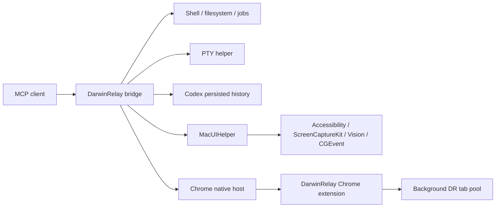

# DarwinRelay

[](https://github.com/dcierra/darwinrelay/actions/workflows/ci.yml)
[](https://github.com/dcierra/darwinrelay/actions/workflows/codeql.yml)
[](https://github.com/dcierra/darwinrelay/actions/workflows/codeql-swift.yml)
[](LICENSE)

**Native macOS execution runtime for MCP agents: shell, PTY, background Chrome, and Accessibility-based desktop control.**

DarwinRelay connects an MCP client to the Mac you are already using. It exposes structured local-machine capabilities without inserting another model loop between the client and macOS: unrestricted shell/filesystem access, interactive PTYs, long-running jobs, persisted Codex history, a managed background Chrome workspace, and native desktop control through Accessibility, ScreenCaptureKit, Vision and CoreGraphics.

> [!CAUTION]
> DarwinRelay is intentionally powerful. It is **not a sandbox** and does not implement a filesystem or shell-command allowlist. A connected client can act with the effective permissions of the macOS user running the bridge. Read [SECURITY.md](SECURITY.md) before exposing it beyond localhost.

## Why DarwinRelay

Many MCP servers expose one narrow API. DarwinRelay is designed as a local execution runtime for developer and computer-use workflows where the useful state already lives on the Mac:

- **Shell and files** — run commands, inspect or modify files, apply patches, and manage local processes.
- **Real PTYs** — interactive shells, REPLs, SSH, sudo prompts, TUIs and long-running terminal programs.
- **Native computer use** — semantic AX queries/actions, windows, dialogs, open/save panels, keyboard/mouse fallback, screenshots, OCR and visual waits.
- **Background browser automation** — a dedicated Chrome extension-owned tab pool that can navigate, inspect, fill and click without routinely stealing focus.
- **Codex history** — read persisted Codex threads without starting a new model turn.
- **Remote MCP transport** — stdio locally, or the included authenticated HTTP/OAuth front end behind a tunnel you control.
- **Fail-closed lifecycle** — explicit full-access unlock, audit logging, process reclamation, singleton menu ownership and rollback-aware app updates.

## Architecture



The native desktop helper is deliberately short-lived rather than a privileged daemon. The menu app, `MacUIHelper`, and virtual cursor use stable code-signing identifiers so macOS TCC grants can survive normal rebuilds when a persistent signing identity is available.

## Requirements

- macOS 13 or newer
- Node.js 18 or newer (Node.js 22 is used in CI)
- Xcode Command Line Tools / `swiftc` for native desktop control and the menu app
- Accessibility and Screen Recording permissions for native computer use
- Google Chrome only if you want the managed `chrome_*` background workspace
- `cloudflared` or another HTTPS tunnel only if you expose the HTTP transport remotely
- Codex CLI only if you want `codex_thread_*` history tools

## Quick start

Clone the repository and build the menu app:

```bash
git clone https://github.com/dcierra/darwinrelay.git
cd darwinrelay
npm run check
./menubar/build.sh
open /Applications/DarwinRelay.app
```

For a compile/sign smoke test with **no installation side effect**, use:

```bash
DARWINRELAY_APP_OUTPUT=/tmp/DarwinRelay.app ./menubar/build.sh --build-only
```

The app appears in the macOS menu bar as **DR**. Grant the requested desktop permissions, then use **Start** for the HTTP/tunnel path you have configured.

For source-only local MCP usage, the bridge can also be run directly. Full access must be explicitly acknowledged:

```bash
export DARWINRELAY_FULL_ACCESS_ACK=I_UNDERSTAND_THIS_GRANTS_FULL_ACCESS
node bridge.mjs
```

The default runtime state lives under:

```text
~/Library/Application Support/DarwinRelay
~/Library/Logs/DarwinRelay
```

Use environment variables such as `DARWINRELAY_DATA_DIR`, `DARWINRELAY_LOG_DIR`, `DARWINRELAY_SHELL`, and `DARWINRELAY_AUDIT_MODE` to isolate development/test instances.

## For AI and coding agents

This repository includes agent-oriented documentation on purpose. If you give the repository to Codex, Claude, ChatGPT or another coding agent, point it at **`AGENTS.md` first**. That file describes the repository map, invariants, development commands, testing expectations, signing/browser rules and release constraints.

For an agent operating an already-installed DarwinRelay runtime rather than modifying source, use **`docs/AGENT_OPERATIONS.md`**. It contains the complete tool-family map, preferred decision order, common failure states and safe runtime workflows. **`docs/ARCHITECTURE.md`** describes component/data flow and trust boundaries for deeper reasoning.

## Native desktop control

DarwinRelay prefers semantic Accessibility operations and uses visual/raw input as a fallback. Core capabilities include:

- `ui_observe`, `ui_tree`, `ui_ax_query`, `ui_ax_at`
- fingerprinted AX refs with stale-ref detection
- `ui_action`, `ui_wait_for`, `ui_assert`
- `ui_app_*`, `ui_window_*`, dialogs and file panels
- ScreenCaptureKit screenshots and Vision OCR
- background PID-targeted input where macOS supports it, with semantic verification and bounded foreground fallback
- `ui_sequence` for deterministic multi-step native bursts
- a click-through virtual AI cursor that does not move the physical pointer

See [docs/DESKTOP_CONTROL.md](docs/DESKTOP_CONTROL.md) for the control model and limitations.

## Background Chrome workspace

DarwinRelay uses an unpacked Chrome extension plus Native Messaging. The public extension identity is stable; the expected extension id is:

```text
pfhahlehpahegefejooendokpkklgmgd
```

The installer creates or reuses a **signed-out local Chrome profile named `DarwinRelay` by default**. This keeps agent browsing state separate from an everyday Google profile:

```bash
# Recommended/default: dedicated local profile named DarwinRelay
./scripts/install-background-chrome.sh

# Explicit alternatives only when you want them
./scripts/install-background-chrome.sh --profile 'Some Existing Profile'
./scripts/install-background-chrome.sh --use-current-profile
```

The default profile is created without deleting or modifying browsing data in other profiles. **If the DarwinRelay profile does not exist yet, quit Chrome once before running the installer** so Chrome cannot concurrently rewrite its `Local State`; after the profile exists, normal reinstalls can run while Chrome is open. Uninstalling DarwinRelay deliberately leaves that profile in place because browser profile contents are user data.

Then, in **the selected profile only**, open `chrome://extensions`, enable Developer mode, choose **Load unpacked**, and select this repository's `chrome-extension/` directory. You can pass `--open` to the installer for this one-time setup step.

The extension owns a Chrome-native tab group named **DR**. Routine `chrome_open` calls lease pre-created idle tabs instead of creating arbitrary foreground tabs. `chrome_close` returns workspace tabs to the pool.

### Browser security model

Relaxed approvals are the default. Normal HTTP/HTTPS work through the configured `chrome_*` workspace does not need a per-site terminal grant. Enabling **Strict approvals** in the menu app restores scoped URL grants and one-use app-scoped native mutation approvals.

Direct Chrome automation through shell/AppleScript/JXA remains blocked by the bridge so normal web work stays on the managed background path. The separate native `ui_*` surface can still interact with foreground Chrome UI when browser/OS security surfaces genuinely require it.

An optional raw Browser Harness/CDP adapter exists behind `DARWINRELAY_ADVANCED_BROWSER=1`. It is disabled by default and fails closed under Strict approvals because arbitrary CDP cannot be soundly reduced to URL scopes.

## HTTP / OAuth transport

`mcp-http.mjs` binds to loopback and supports the MCP HTTP transport with a static bearer token plus OAuth 2.1 flows used by remote MCP clients. A tunnel such as Cloudflare can publish the loopback service over HTTPS.

A minimal local front end looks like:

```bash
mkdir -p "$HOME/Library/Application Support/DarwinRelay"
openssl rand -hex 32 > "$HOME/Library/Application Support/DarwinRelay/http-token"
chmod 600 "$HOME/Library/Application Support/DarwinRelay/http-token"

export DARWINRELAY_HTTP_TOKEN_FILE="$HOME/Library/Application Support/DarwinRelay/http-token"
node mcp-http.mjs
```

Do not expose the HTTP endpoint without reading the remote-access threat model in [SECURITY.md](SECURITY.md). A credential accepted by this front end ultimately gates local code execution as your desktop user.

The repository also retains the OpenAI Secure MCP Tunnel installer inherited from the original project for users who prefer that transport. See [DEPLOY.md](DEPLOY.md).

## Development

```bash
npm run check
npm run test:core
npm run test:desktop
npm run test:lifecycle
# or all groups
npm test
```

The public CI intentionally exposes separate checks instead of one opaque `test` job:

- **Static checks** — syntax/native build validation and full-history gitleaks scan
- **Core & protocol tests** — MCP, HTTP/OAuth, PTY, federation, browser and adversarial tests
- **Desktop control tests** — deterministic desktop protocol tests plus native fixture compilation
- **Install & lifecycle tests** — installers, autostart, singleton ownership, rollback and uninstall behavior

The real mutable AppKit E2E needs a logged-in Mac with TCC permissions and therefore is not treated as reliable on disposable GitHub-hosted GUI sessions. Maintainers can run it locally with:

```bash
DARWINRELAY_RUN_NATIVE_DESKTOP_E2E=1 node tests/desktop-control-native.mjs
```

See [CONTRIBUTING.md](CONTRIBUTING.md) before opening a pull request.

## Security

The important boundary is simple: **DarwinRelay has the authority of the macOS account that runs it.** Security features such as the unlock file, Strict approvals, audit metadata, OAuth, background browser routing and process reclamation reduce accidental or remote misuse; they do not turn arbitrary shell access into a sandbox.

Security reports should use GitHub's private vulnerability reporting rather than a public issue. See [SECURITY.md](SECURITY.md).

## Project lineage

DarwinRelay is independently maintained and substantially diverged from **Mac Developer Bridge** by Alexander Rådahl Benz. The inherited upstream history is intentionally preserved, and the original MIT copyright notice remains in [LICENSE](LICENSE). See [UPSTREAM.md](UPSTREAM.md) for the exact lineage and attribution policy.

The public `dcierra/darwinrelay` repository is the canonical development source. The previous private repository is retained only as a temporary legacy production/rollback lineage until the installed 0.5.x runtime is migrated; it is not a second active development branch. See [docs/DEVELOPMENT_MODEL.md](docs/DEVELOPMENT_MODEL.md) for the commit-history mapping and future workflow.

DarwinRelay is not affiliated with or endorsed by OpenAI, Apple, Google, Cloudflare, or the upstream maintainer.

## License

MIT. See [LICENSE](LICENSE) and [UPSTREAM.md](UPSTREAM.md).
