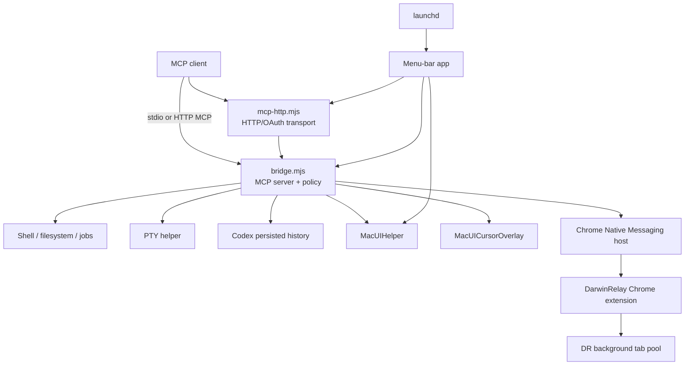
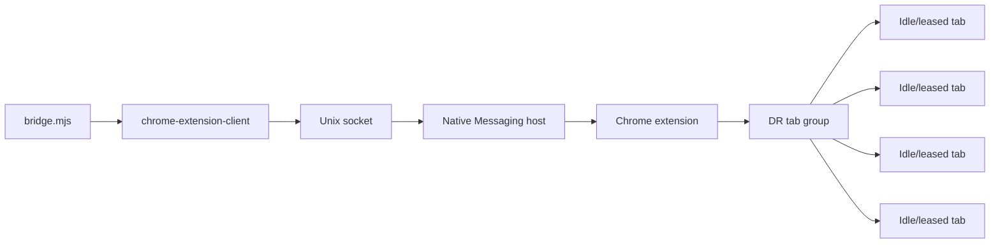

# DarwinRelay Architecture

## Overview

DarwinRelay is a local macOS MCP execution runtime. It has one design goal: expose useful machine authority to an MCP client through structured, auditable tools without inserting another reasoning/model loop between the client and the Mac.



## Trust model

DarwinRelay does not sandbox its shell/filesystem surface. Effective authority is the macOS account running it, constrained only by ordinary OS controls such as TCC, filesystem ACLs and sudo authentication.

Security mechanisms therefore focus on:

- explicit full-access acknowledgement;
- authentication for remote HTTP/OAuth transport;
- bounded helper/process lifetime;
- audit metadata/redaction and request/session provenance;
- fail-closed semantic refs and approval scopes;
- stable code identity for TCC;
- controlled Chrome routing;
- deterministic cleanup and singleton runtime ownership.

See `SECURITY.md` for the normative security contract.

## Core bridge

`bridge.mjs` is the primary MCP server. It owns:

- tool schemas and dispatch;
- filesystem/shell/background-job operations;
- PTY session lifecycle;
- persisted Codex history access;
- federation/provider lifecycle;
- native desktop helper invocation;
- background Chrome client integration;
- approval policy and audit handling;
- shutdown/revocation reclamation.

`package.json.version` is the canonical server version source.

## Transport layer

DarwinRelay supports local stdio and an HTTP front end.

`mcp-http.mjs`:

- binds to loopback;
- supports authenticated MCP HTTP requests;
- accepts a static bearer token for compatible clients;
- implements OAuth 2.1 authorization-code + PKCE flows for MCP clients that use OAuth discovery;
- persists only the state needed for OAuth continuity;
- assigns a non-secret transport request id to each authenticated MCP request;
- converts an optional `Mcp-Session-Id` header into a process-local HMAC correlation id instead of logging the raw header;
- carries an opaque OAuth-grant session id across refreshes without deriving it from access/refresh token material;
- scrubs sensitive transport credentials from child bridge environments;
- respawns the bridge child and replays the MCP initialize handshake when needed.

`bridge.mjs` independently assigns its own `correlationId` to every valid JSON-RPC request and stores request provenance in `AsyncLocalStorage`, because several requests may execute concurrently inside one bridge process. Tool audit entries therefore carry `correlationId`, `transport`, optional `transportRequestId`, optional `sessionCorrelationId`, `sessionSource`, and `authMode`. Background shell jobs and PTY reclaimer metadata preserve the creating request provenance; `shell_exec` audit summaries also record the spawned pid. These identifiers are observability metadata, not authorization or per-conversation capability leases.

A reverse tunnel such as Cloudflare can publish the loopback HTTP service. The tunnel does not make the bridge safer by itself; authentication still gates desktop-user authority.

## Menu app and lifecycle

The Swift menu-bar application is the normal macOS supervisor for the HTTP/tunnel path.

Responsibilities include:

- start/stop/quit lifecycle;
- full-access unlock state;
- bearer-token file management;
- OAuth client id display/copy;
- desktop permission status;
- Strict approvals toggle;
- spawning `mcp-http.mjs` and tunnel process;
- reclaiming stale child pidfiles;
- singleton runtime ownership.

A file lock in the DarwinRelay data directory ensures only one menu instance owns shared runtime state. A second instance exits before touching the first instance's unlock/pidfiles/transport.

The optional LaunchAgent `io.github.dcierra.darwinrelay.http` can start the menu app at login and recover it after abnormal exit.

## Native desktop runtime

### `MacUIHelper`

The helper is a bounded short-lived Swift process launched per native tool call. It uses:

- Accessibility / AXUIElement / AXObserver;
- AppKit;
- ScreenCaptureKit;
- Vision;
- CoreGraphics / CGEvent;
- NSPasteboard.

It is not a permanent privileged daemon.

### Semantic refs

AX elements are returned through fingerprinted refs. The fingerprint includes semantic and geometric identity so a ref that no longer addresses the observed element fails closed rather than silently acting on another control.

Observation ids can bind actions to a recent generation. Stale refs can only be recovered through bounded unique fingerprint matching.

### Input hierarchy

The intended control hierarchy is:

1. semantic AX query/action;
2. background PID-targeted raw input where suitable;
3. semantic verification;
4. one bounded foreground compatibility fallback when explicitly permitted;
5. visual/OCR coordinate fallback when semantics are unavailable.

A low-level event-post success is not treated as semantic success.

### Screenshots and OCR

ScreenCaptureKit handles display/window/region capture. Vision performs OCR. Visual waits use bounded grayscale comparisons rather than unbounded image polling.

### Virtual cursor

`MacUICursorOverlay` is a click-through visual overlay independent of the physical mouse. It can be rendered into screenshots for agent observability without moving the user's pointer.

## Code signing and TCC

The menu app, `MacUIHelper` and `MacUICursorOverlay` use separate stable identifiers under the same DarwinRelay namespace. When a persistent Apple signing identity exists, all three are signed with that identity.

This matters because TCC trust is attached to code identity. Rebuilding ad-hoc binaries can change designated requirements and invalidate prior grants.

Build/deploy scripts therefore:

- preserve stable identifiers;
- prefer one real signing identity across the runtime;
- verify nested signatures;
- refuse unexpected designated-requirement changes unless explicitly overridden;
- retain rollback bundles for atomic app replacement.

## Background Chrome architecture



The public installer creates/reuses a dedicated signed-out Chrome profile named **DarwinRelay** by default. On first creation it refuses to rewrite Chrome `Local State` while Chrome is running; the user quits Chrome once, the installer atomically registers the profile, and later reinstalls can reuse it without that restriction. The profile binding is recorded in the DarwinRelay data directory.

The extension owns a native Chrome tab group named `DR` and a reusable idle tab pool. Routine `chrome_open` calls lease a pool tab rather than creating a new foreground tab. Closing a managed tab returns it to the pool.

The Native Messaging host is copied into `~/Library/Application Support/DarwinRelay` rather than executed directly from a repository under Documents. This avoids a macOS TCC failure mode where Chrome, as the responsible process, can block while trying to execute source from a protected user directory.

### Profile binding modes

`dedicated-local`:

- default;
- profile is expected to remain signed out;
- isolates agent browser state from an everyday Google identity;
- extension should be loaded only in the selected profile.

`signed-in`:

- explicit profile choice or `--use-current-profile` opt-in;
- binding records expected Google email/GAIA id;
- host fails closed when the connected extension identity no longer matches the recorded account state.

The extension APIs do not expose a trustworthy Chrome profile directory/name to Native Messaging, so loading the extension only in the bound profile remains an operational invariant.

## Optional Browser Harness / raw CDP

`lib/advanced-browser.mjs` provides a separate opt-in adapter to an already-running Browser Harness Unix socket.

Properties:

- disabled unless `DARWINRELAY_ADVANCED_BROWSER=1` is present before bridge startup;
- DarwinRelay does not install or start Browser Harness;
- socket ownership must match the current uid;
- calls/events are bounded;
- raw params are audit-redacted;
- raw CDP is blocked under Strict approvals.

This backend does not replace the managed `chrome_*` path.

## Persistent runtime state

Defaults:

```text
~/Library/Application Support/DarwinRelay/
~/Library/Logs/DarwinRelay/
```

State can include:

- full-access unlock file;
- HTTP bearer token file;
- OAuth state;
- audit log;
- background-job metadata/logs;
- Chrome Native Messaging wrapper/host copy;
- Chrome profile binding;
- browser grants;
- singleton lock and supervised pidfiles.

The repository must never contain live copies of these files.

## Testing architecture

The public test surface is intentionally split.

### Static checks

- JavaScript syntax;
- Swift/helper/menu/fixture build checks;
- complete menu bundle build;
- full-history gitleaks scan.

### Core & protocol

- MCP smoke/integration;
- poisoned-repository adversarial behavior;
- HTTP/OAuth;
- PTY lifecycle;
- federation;
- background Chrome protocol;
- optional advanced-browser protocol.

### Desktop control

- deterministic fake-helper protocol coverage;
- native fixture compilation;
- native runtime test automatically stops at a real TCC boundary on hosted environments.

### Install & lifecycle

- background Chrome profile/host installer;
- HTTP autostart;
- atomic app installation/rollback;
- singleton menu ownership;
- full macOS installer mock/uninstall.

Real mutable AppKit input is tested on a logged-in maintainer Mac with:

```bash
DARWINRELAY_RUN_NATIVE_DESKTOP_E2E=1 node tests/desktop-control-native.mjs
```

It is not considered a reliable assertion on disposable hosted GUI sessions.

## Public/private development model

The public `dcierra/darwinrelay` repository is intended to be the canonical product source. Machine credentials, production OAuth/tunnel state, TCC grants and signing private material remain local and are not synchronized through Git.

If private operational configuration is ever versioned, it should live in a small separate ops repository that pins a DarwinRelay commit/tag rather than maintaining a second divergent copy of product source.

## Project lineage

The repository preserves inherited Git history from Mac Developer Bridge under the MIT license. `UPSTREAM.md` records the lineage and attribution boundary. Current runtime identifiers are DarwinRelay-owned and do not use upstream/OpenAI namespaces.
